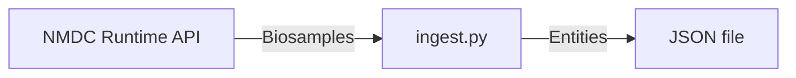

# NMDC

This script fetches data from the NMDC Runtime API, transforms it into BERtron-compliant data, and writes it to a JSON file.



## Usage

```sh
uv run python ingest.py --help
```

<!-- 
Note: The following usage string was copy/pasted from the output of `$ python ingest.py --help` in a terminal window that was 80 pixels wide.
-->

```console
 Usage: ingest.py [OPTIONS]

 Fetch NMDC data, transform it into BERtron-compliant data, and write it to a
 JSON file.

 This script fetches biosample data from the NMDC Runtime API (or loads it from
 a file, if specified), validates it against the NMDC Schema, transforms it
 into a shape that is compliant with the BERtron Schema, then writes it to a
 JSON file.

╭─ Options ────────────────────────────────────────────────────────────────────╮
│ --cache-from              FILE                  Path to a JSON file          │
│                                                 previously created via       │
│                                                 --cache-to, from which you   │
│                                                 want the script to load NMDC │
│                                                 data. If not specified, the  │
│                                                 script will download NMDC    │
│                                                 data from the Internet.      │
│ --cache-to                FILE                  Path at which you want the   │
│                                                 script to create a JSON file │
│                                                 containing the NMDC data the │
│                                                 script downloads from the    │
│                                                 Internet. That path can then │
│                                                 be specified to the script   │
│                                                 via --cache-from on a        │
│                                                 subsequent run, in order to  │
│                                                 avoid downloading the same   │
│                                                 data again from the          │
│                                                 Internet.                    │
│ --output-dir              PATH                  Path to directory in which   │
│                                                 you want the JSON file(s)    │
│                                                 containing BERtron entities  │
│                                                 to be created.               │
│                                                 [default: .]                 │
│ --target-file-size        INTEGER RANGE [x>=1]  Number of bytes you want     │
│                                                 each JSON file to contain.   │
│                                                 Each time the script writes  │
│                                                 an additional BERtron entity │
│                                                 to a file, it will compare   │
│                                                 the file's size to this      │
│                                                 number, in order to          │
│                                                 determine whether to         │
│                                                 continue growing the file or │
│                                                 start a new file. This is    │
│                                                 not a hard limit.            │
│                                                 [default: 25000000]          │
│ --help                                          Show this message and exit.  │
╰──────────────────────────────────────────────────────────────────────────────╯
```

## Development

<!-- markdownlint-disable -->
<details>
<summary>Show/hide developer docs</summary>
<!-- markdownlint-enable -->

### Quick start

Prerequisite(s):

- [uv](https://docs.astral.sh/uv/) is installed

#### Set up Python virtual environment

You can set up a Python virtual environment by issuing the following command **from
the current directory** (i.e. the directory containing this `README.md` file):

```shell
uv sync
```

That command will:

1. **Create a Python virtual environment** at `.venv` (if one doesn't already
   exist there)
2. **Install all dependencies** described in `uv.lock` into that Python virtual environment
3. Uninstall all dependencies _not_ described in `uv.lock` from that Python
   virtual environment

#### Activate Python virtual environment

Now that you have set up a Python virtual environment, you can activate it by
issuing the following command:

```shell
source .venv/bin/activate
```

> Note: Once you're ready to _deactivate_ the Python virtual environment,
> you can do so by running `$ deactivate`.

Run the ingest script.

```shell
uv run ingest.py
```

#### Format code

We use [`ruff`](https://docs.astral.sh/ruff/formatter/) as the code _formatter_.

You can _check_ the code's format by running:

```shell
uv run ruff format --diff
```

You can _format_ the code by running:

```shell
uv run ruff format
```

#### Lint code

We also use [`ruff`](https://docs.astral.sh/ruff/linter/) as the code _linter_.

You can _check_ the code's compliance with the "linter rules" by running:

```shell
uv run ruff check
```

#### Check types

We use [mypy](https://mypy.readthedocs.io/en/stable/) as the static type checker.

You can perform static type checking by running:

```shell
uv run mypy
```

#### Profile performance

We use [`pyinstrument`](https://pyinstrument.readthedocs.io/en/latest/) for performance
profiling.

You can perform performance profiling by running:

```shell
uv run pyinstrument ingest.py
```
