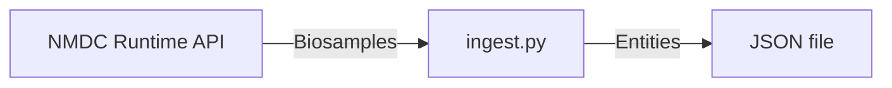

# NMDC

This script fetches data from the NMDC Runtime API, transforms it into BERtron-compliant data, and writes it to a JSON file.



## Usage

```sh
python ingest.py --help
```

<!-- 
Note: The following usage string was copy/pasted from the output of `$ python ingest.py --help` in a terminal window that was 80 pixels wide.
-->

```console
 Usage: ingest.py [OPTIONS]

 Fetch NMDC data, transform it into BERtron-compliant data, and write it to a
 JSON file.

 This script fetches biosample data from the NMDC Runtime API (or loads it from
 a file, if specified), validates it against the NMDC Schema, transforms it
 into a shape that is compliant with the BERtron Schema, then writes it to a
 JSON file.

╭─ Options ────────────────────────────────────────────────────────────────────╮
│ --cache-from          FILE  Path to a JSON file previously created via       │
│                             --cache-to, from which you want the script to    │
│                             load NMDC data. If not specified, the script     │
│                             will download NMDC data from the Internet.       │
│ --cache-to            FILE  Path at which you want the script to create a    │
│                             JSON file containing the NMDC data the script    │
│                             downloads from the Internet. That path can then  │
│                             be specified to the script via --cache-from on a │
│                             subsequent run, in order to avoid downloading    │
│                             the same data again from the Internet.           │
│ --output      -o      FILE  Path at which you want the JSON file containing  │
│                             BERtron data to be created.                      │
│                             [default: nmdc_00001.json]                       │
│ --help                      Show this message and exit.                      │
╰──────────────────────────────────────────────────────────────────────────────╯
```

## Development

<!-- markdownlint-disable -->
<details>
<summary>Show/hide developer docs</summary>
<!-- markdownlint-enable -->

### Quick start

Prerequisite(s):

- Python 3.12 is installed
- [uv](https://docs.astral.sh/uv/) is installed (only required if you will be
  running the `uvx` commands shown below)

Set up a Python virtual environment.

```sh
python -m venv .venv
source .venv/bin/activate
python -m pip install --no-cache-dir -r requirements.txt
```

> I included `--no-cache-dir` in the installation command in an attempt to
> reduce the chances that any developer ends up using an out-of-date version
> of the BERtron schema, whose version number does not yet change from one
> "release" to the next.

Run the ingest script.

```sh
python ingest.py
```

Format code.

```sh
uvx ruff format
```

Lint code.

```sh
uvx ruff check
```

Deactivate the Python virtual environment.

```sh
deactivate
```

</details>
